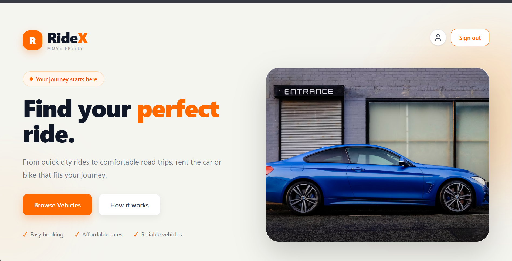
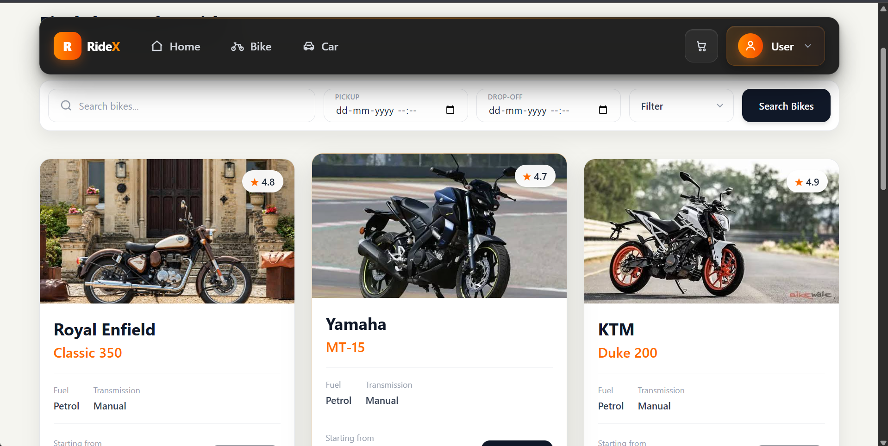
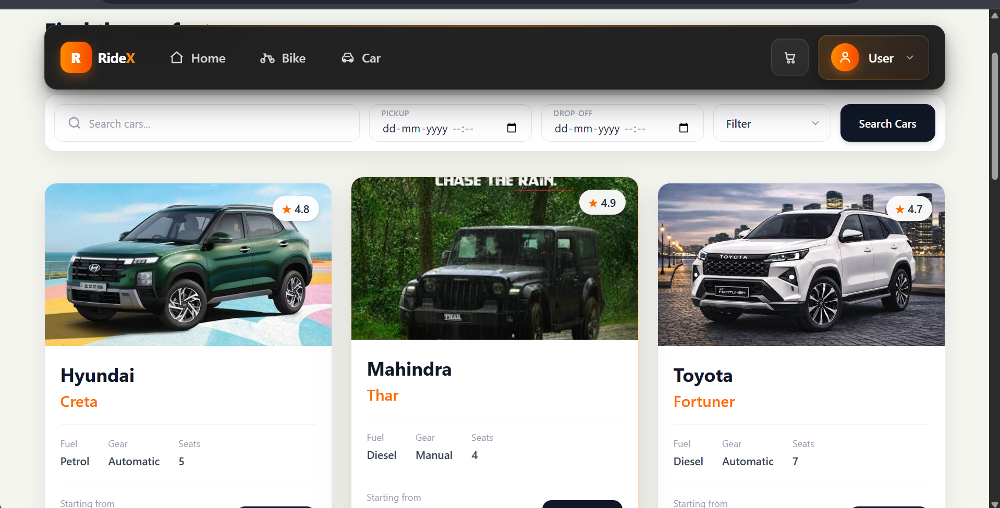

# 🚗 RideX — Vehicle Rental Platform

RideX is a full-stack vehicle rental platform that allows users to discover, compare, and book cars and bikes for their desired rental period.

The platform also supports vehicle owners who want to list, manage, and track their rental vehicles.

---

## 🌐 Live Demo

### Frontend

https://ridex-bay.vercel.app

### Backend API

https://ridex-365i.onrender.com

---

## 📸 Screenshots

### Home Page



### Bike Listing



### Car Listing



---

# ✨ Features

## 👤 User Features

- User registration and login
- Secure JWT authentication
- Access token and refresh token authentication
- HTTP-only cookies for authentication
- Protected routes
- Automatic access-token refresh
- Browse available cars
- Browse available bikes
- Search vehicles
- Filter vehicles
- Select pickup and drop-off dates
- Check vehicle availability
- Add vehicles to cart
- Manage cart items
- Book vehicles
- View booking details
- View upcoming bookings
- View completed bookings
- View cancelled bookings
- Cancel eligible bookings
- User account management

---

## 🚘 Vehicle Features

RideX supports two vehicle categories: **Cars** and **Bikes**.

### Cars

Users can:

- Browse cars
- View detailed car information
- Check rental price
- Check fuel type
- Check transmission
- Check seating capacity
- View mileage
- View ratings and reviews
- Check availability
- Book cars

### Bikes

Users can:

- Browse bikes
- View detailed bike information
- Check rental price
- Check fuel type
- Check transmission
- View engine capacity
- View mileage
- View ratings and reviews
- Check availability
- Book bikes

---

# 🏠 Vehicle Owner Features

RideX allows users to act as both renters and vehicle owners.

Vehicle owners can:

- List a vehicle
- Upload vehicle images
- View their listed vehicles
- Edit vehicle information
- List or unlist vehicles
- Delete vehicles
- View booking statistics
- View vehicle earnings
- Track rental activity

Security-sensitive actions such as unlisting or deleting a vehicle require owner credential verification.

---

# 📅 Booking System

RideX includes an availability-based booking system.

Before creating a booking, the system checks whether another confirmed booking overlaps with the requested rental period.

The backend performs the final availability check to prevent conflicting bookings.

### Booking information includes:

- Booking code
- Renter
- Vehicle
- Vehicle number
- Vehicle type
- Pickup date/time
- Drop-off date/time
- Rental duration
- Rental amount
- Platform fee
- Owner earnings
- Total amount
- Payment method
- Payment status
- Booking status
- Pickup location
- Drop-off location
- Driving license number
- Special requests

---

# 💰 Rental Pricing

RideX uses an hourly-based billing system with a maximum of 20 billable hours per 24-hour period.

The billing logic is:

```text
If duration < 20 hours
    billable hours = actual duration

Otherwise
    billable hours =
        complete 24-hour blocks × 20
        + remaining hours capped at 20
```

### Examples

| Actual Duration | Billable Hours |
|---:|---:|
| 10 hours | 10 |
| 20 hours | 20 |
| 24 hours | 20 |
| 25 hours | 21 |
| 30 hours | 26 |
| 48 hours | 40 |

The backend calculates the final rental amount to prevent pricing manipulation from the frontend.

---

# 🔐 Authentication & Security

RideX uses JWT-based authentication with access and refresh tokens.

### Authentication Flow

```text
User Login
    ↓
Backend validates credentials
    ↓
Access Token + Refresh Token
    ↓
HTTP-only Cookies
    ↓
Authenticated API Requests
    ↓
Access Token expires
    ↓
Refresh Token generates new Access Token
    ↓
User continues without logging in again
```

The frontend uses an Axios interceptor to automatically attempt token refresh when an authenticated request receives a `401 Unauthorized` response.

---

# 🛠️ Tech Stack

## Frontend

- React
- TypeScript
- Vite
- Tailwind CSS
- React Router
- Axios
- React Toastify

## Backend

- Node.js
- Express.js
- TypeScript
- MongoDB
- Mongoose
- JWT
- bcrypt
- Multer
- Cookie Parser
- CORS

## Deployment

- Vercel — Frontend
- Render — Backend
- MongoDB Atlas — Database

---

# 📁 Project Structure

```text
RideX/
│
├── Backend/
│   │
│   ├── Config/
│   │   └── db.ts
│   │
│   ├── Controller/
│   │   ├── Auth/
│   │   ├── Booking/
│   │   ├── Vehicle/
│   │   └── ...
│   │
│   ├── Middleware/
│   │
│   ├── Model/
│   │   ├── UserModel.ts
│   │   ├── CarModel.ts
│   │   ├── BikeModel.ts
│   │   ├── BookingModel.ts
│   │   └── ...
│   │
│   ├── Routes/
│   │
│   ├── Types/
│   │
│   ├── utils/
│   │
│   ├── app.ts
│   ├── package.json
│   └── .env
│
├── frontend/
│   │
│   ├── src/
│   │   ├── components/
│   │   ├── pages/
│   │   ├── context/
│   │   └── ...
│   │
│   ├── public/
│   ├── package.json
│   └── .env
│
├── screenshots/
│   ├── home.png
│   ├── bikes.png
│   └── cars.png
│
├── .gitignore
└── README.md
```

---

# ⚙️ Installation & Setup

## 1. Clone the Repository

```bash
git clone https://github.com/soham1334/RideX.git
```

```bash
cd RideX
```

---

# 🔧 Backend Setup

Navigate to the backend:

```bash
cd Backend
```

Install dependencies:

```bash
npm install
```

Create a `.env` file:

```env
MONGO_URI=your_mongodb_connection_string

ACCESS_TOKEN_SECRET=your_access_token_secret

REFRESH_TOKEN_SECRET=your_refresh_token_secret

FRONTEND_URL=http://localhost:5173

NODE_ENV=development
```

Start the backend:

```bash
npm start
```

The backend will run on:

```text
http://localhost:5000
```

---

# 💻 Frontend Setup

Open another terminal:

```bash
cd frontend
```

Install dependencies:

```bash
npm install
```

Create a `.env` file:

```env
VITE_API_SERVER=http://localhost:5000
```

Start the development server:

```bash
npm run dev
```

The frontend will normally run on:

```text
http://localhost:5173
```

---

# 🌍 Production Environment Variables

## Vercel

The frontend requires:

```env
VITE_API_SERVER=https://ridex-365i.onrender.com
```

## Render

The backend requires:

```env
MONGO_URI=your_mongodb_connection_string

ACCESS_TOKEN_SECRET=your_access_token_secret

REFRESH_TOKEN_SECRET=your_refresh_token_secret

FRONTEND_URL=https://ridex-bay.vercel.app

NODE_ENV=production
```

> Never commit `.env` files or backend secrets to GitHub.

---

# 🔄 Application Architecture

```text
                    ┌──────────────────────┐
                    │      React App       │
                    │   TypeScript + Vite  │
                    └──────────┬───────────┘
                               │
                               │ Axios / REST API
                               ▼
                    ┌──────────────────────┐
                    │    Express Server    │
                    │ Node.js + TypeScript  │
                    └──────────┬───────────┘
                               │
                               │ Mongoose
                               ▼
                    ┌──────────────────────┐
                    │     MongoDB Atlas    │
                    └──────────────────────┘
```

---

# 🔑 Main API Areas

The backend provides APIs for:

```text
Authentication
    ├── Signup
    ├── Login
    ├── Logout
    └── Refresh Token

Vehicles
    ├── Cars
    ├── Bikes
    ├── Vehicle Details
    └── Availability

Cart
    ├── Add Vehicle
    ├── Remove Vehicle
    └── View Cart

Bookings
    ├── Create Booking
    ├── My Bookings
    ├── Upcoming
    ├── Completed
    └── Cancel Booking

Host
    ├── List Vehicle
    ├── Listed Vehicles
    ├── Edit Vehicle
    ├── List / Unlist
    └── Delete Vehicle
```

---

# 🧠 Backend Design

RideX follows an important principle:

> The frontend is responsible for user experience, while the backend is responsible for enforcing business rules.

For example, vehicle availability can be checked on the frontend to provide immediate feedback.

However, the backend performs another availability check when the booking is actually created.

This prevents two users from successfully booking the same vehicle for overlapping dates.

Similarly, rental prices are calculated by the backend instead of trusting a price supplied by the client.

---

# 📊 Vehicle Owner Earnings

For every rental, RideX stores information such as:

```text
Rental Amount
Platform Fee
Owner Earnings
Total Amount
Payout Status
```

This allows the platform to track earnings for individual vehicles and vehicle owners.

---

# 🚀 Deployment

The project uses the following deployment architecture:

```text
Frontend
    ↓
Vercel

Backend
    ↓
Render

Database
    ↓
MongoDB Atlas
```

The frontend and backend are deployed independently.

Docker is not required for the current deployment architecture.

---

# 🔒 Environment Variables

The following files should never be committed to GitHub:

```text
.env
.env.*
```

The repository should use `.gitignore` to prevent environment variables and generated files from being uploaded.

A `.env.example` file can be used to document required variables without exposing secrets.

Example backend variables:

```env
MONGO_URI=
ACCESS_TOKEN_SECRET=
REFRESH_TOKEN_SECRET=
FRONTEND_URL=
NODE_ENV=
```

Example frontend variable:

```env
VITE_API_SERVER=
```

---

# 🧪 Building for Production

## Frontend

```bash
cd frontend
npm run build
```

The production files are generated in:

```text
frontend/dist/
```

## Backend

The backend is started using:

```bash
npm start
```

---

# 🎯 Future Improvements

Possible future improvements include:

- Online payment gateway integration
- Automated owner payouts
- Vehicle location support
- Advanced vehicle filtering
- Reviews and ratings from verified renters
- Booking notifications
- Email notifications
- Admin dashboard
- Vehicle approval workflow
- Booking analytics
- Revenue analytics
- Image optimization
- Pagination
- Lazy loading
- Improved search
- Mobile-first improvements

---

# 👨‍💻 Author

## Soham

RideX was built as a full-stack project to explore real-world web application development, including:

- React development
- TypeScript
- Tailwind CSS
- REST APIs
- JWT authentication
- Refresh token authentication
- MongoDB and Mongoose
- Vehicle booking systems
- Availability checking
- File uploads
- Protected routes
- Backend business logic
- Cloud deployment

---

# 📄 License

This project is currently intended for learning and portfolio purposes.